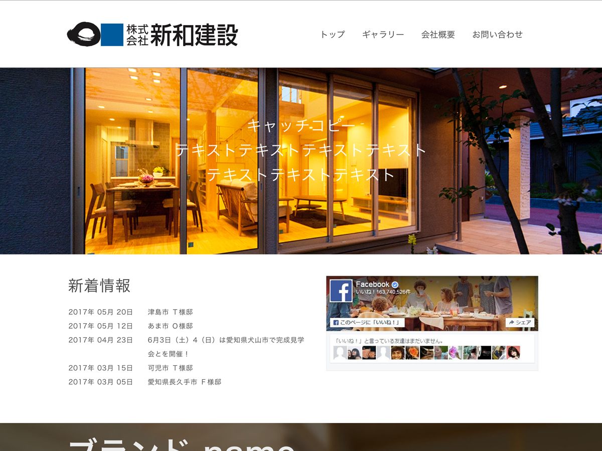

# ポートフォリオサイト



## 📘 概要

このリポジトリは、個人のポートフォリオサイトのソースコードです。  
Webデザイン、フロントエンド開発、バックエンド実装のスキルを総合的に示すことを目的としています。

## 🌐 サイトURL

[https://example.com](https://example.com)  
※ 公開済みの場合は上記リンクからアクセスできます。

## 🧩 使用技術

| カテゴリ | 技術 |
|-----------|------|
| フロントエンド | HTML / CSS / JavaScript / jQuery |
| バックエンド | PHP |
| データベース | MySQL |
| インフラ | Xserver / GitHub Pages（開発環境） |
| デザイン | Figma / Adobe XD |

## 🖥️ 主なページ構成

| ページ | 説明 |
|--------|------|
| `index.php` | トップページ。最新の制作物や自己紹介を掲載。 |
| `profile.php` | 経歴・スキルセットを紹介。 |
| `garally.php` | 制作実績をギャラリー形式で表示。 |
| `detail.php` | 各制作物の詳細ページ。 |
| `contact.php` | お問い合わせフォーム（PHPメール送信機能付き）。 |

## 🚀 特徴

- **レスポンシブデザイン対応**（スマホ・タブレット・PC）
- **WordPressテーマ化を想定した構成**
- **軽量で高速な読み込み**
- **SEOを意識したHTML構造**
- **再利用性の高い関数群（`functions.php`）**

## 🧠 学んだこと

- PHPによる動的ページ生成
- CSS設計（BEM記法）
- JavaScriptによるDOM操作とアニメーション
- GitHubを用いたバージョン管理
- Webサイト公開までの一連の流れ

## 📂 ディレクトリ構成

```
portfolio/
├── index.php
├── profile.php
├── garally.php
├── detail.php
├── functions.php
├── style.css
├── js/
├── css/
├── functions-include/
└── screenshot.png
```

## 🧑‍💻 作者

**名前:** Toshihiro Okada  
**GitHub:** [okadatoshihiro](https://github.com/okadatoshihiro)  
**Email:** example@example.com

## 📄 ライセンス

このプロジェクトは [MIT License](https://opensource.org/licenses/MIT) のもとで公開されています。

---

> 参考資料  
> - [GitHub Docs: 基本的な書き方とフォーマット](https://docs.github.com/ja/get-started/writing-on-github/getting-started-with-writing-and-formatting-on-github/basic-writing-and-formatting-syntax)  
> - [Qiita: READMEの書き方](https://qiita.com/dfalcon0001/items/843b93d90f21b9e99d50)  
> - [C++ Learning: READMEの作り方](https://cpp-learning.com/readme/)
